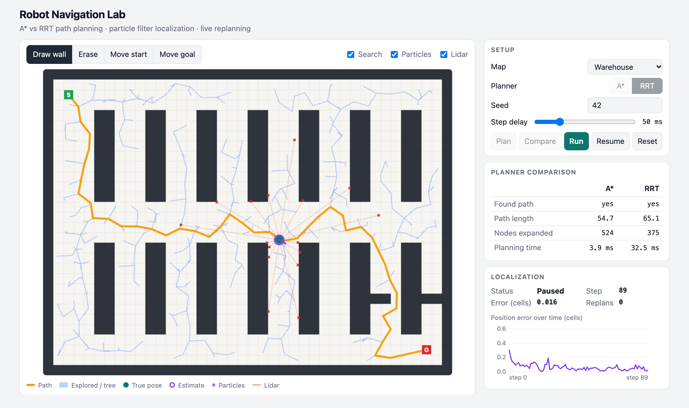

# Robot Navigation Lab

A small full-stack robot navigation simulator that runs in the browser. You draw a 2D grid world (or load a maze, warehouse or open-field preset), plan a path with **A\*** or **RRT**, then watch a robot follow it with noisy motion while a **particle filter** works out where the robot is from a simulated lidar. If you draw a wall on the path mid-run, the robot replans around it.

All the robotics code is plain Python + NumPy in a FastAPI backend (no ROS). The React frontend draws everything on an HTML canvas. Nothing needs an API key, an account or a paid service.



*RRT run on the warehouse map. Blue lines: the RRT tree. Orange: the planned path. Red: the 16 lidar beams. The purple particles are hidden under the robot because the filter has already converged (position error 0.016 cells).*

---

## What it does

- **Grid editor**: draw/erase walls, move the start (S) and goal (G), load presets.
- **Path planning**: A\* and RRT. The map shows what each planner explored (A\*'s visited cells, RRT's tree) and the final path. A side-by-side table shows path length, nodes expanded and planning time.
- **Motion**: the robot turns and drives toward the next waypoint. Every move has random noise, so the robot never goes exactly where it was told.
- **Localization**: a particle filter estimates the pose from a 16-beam lidar (ray casting against the map, plus noise). You see the particles, the estimated pose (purple ring), the true pose (teal dot), and a chart of the position error over time.
- **Replanning**: add a wall on the robot's path while it is driving and the backend plans a new path from where the robot thinks it is.
- **Reproducible**: everything random takes a seed. Same seed, same run.

## Planner benchmark

From `python scripts/benchmark.py` (M4 Pro). A\* is deterministic so it runs once; RRT is random so it is the mean over 10 fixed seeds. Times are medians.

| Map | Planner | Success | Path length (cells) | Nodes expanded | Planning time (ms) |
|---|---|---|---|---|---|
| maze | A* | 100% | 119.8 | 315 | 0.9 |
| maze | RRT (mean of 10 seeds) | 100% | 142.2 | 1438 | 311.6 |
| open_field | A* | 100% | 45.9 | 245 | 0.8 |
| open_field | RRT (mean of 10 seeds) | 100% | 52.9 | 106 | 3.0 |
| warehouse | A* | 100% | 54.7 | 524 | 1.8 |
| warehouse | RRT (mean of 10 seeds) | 100% | 62.4 | 319 | 15.7 |

**How to read it:**
- A\* paths are always shorter: A\* is *optimal* on the grid, RRT is not (it keeps the first path it finds, which zig-zags).
- On a small 40×30 grid, A\* is also much faster. RRT's strength is huge or continuous, high-dimensional spaces (like a robot arm with 7 joints) where you can't afford to build and search a full grid.
- RRT struggles in the **maze**: narrow corridors are hard to hit with random samples, so it needs ~14× more nodes and a lot more time. This is the classic "narrow passage" problem of sampling-based planners.
- "Nodes expanded" means cells popped from the priority queue for A\*, and nodes added to the tree for RRT.

---

## Tools and libraries (and why)

| Tool | Why |
|---|---|
| **Python 3.11** | Main language for the robotics code. |
| **NumPy** | Fast array math. The lidar traces thousands of rays per step (16 beams × 400 particles) in one vectorized call instead of a slow Python loop. |
| **FastAPI** | Small, modern Python web framework with built-in WebSocket support and automatic request validation (via Pydantic). |
| **Uvicorn** | The ASGI server that runs FastAPI. |
| **WebSocket** | Streams one message per simulation step from server to browser, and lets the browser send "add wall here" messages back mid-run. Polling would add lag and wasted requests. |
| **React + Vite** | React keeps UI state (tools, toggles, stats) simple; Vite gives an instant dev server and a fast production build. |
| **HTML canvas** | Drawing 1200 cells + 400 particles + beams 20 times a second is easy and fast on a canvas; DOM elements or SVG would be slower. |
| **pytest** (+ httpx) | Unit tests for the algorithms and an end-to-end WebSocket test. httpx is needed by FastAPI's `TestClient`. |
| **oxlint** | Very fast JavaScript linter that came with the Vite template. |
| **GitHub Actions** | CI runs the tests, the benchmark and the frontend build on every push. |

---

## File structure

```
robot-navigation-lab/
├── README.md                      This file
├── requirements.txt               Python packages (pinned versions)
├── .gitignore                     Keeps secrets, caches, node_modules and builds out of git
├── .github/workflows/ci.yml       CI: pytest + benchmark smoke test + frontend lint/build
├── docs/screenshot.png            Screenshot used in this README
├── scripts/
│   └── benchmark.py               Compares A* vs RRT on every preset, prints a Markdown table
├── backend/
│   ├── conftest.py                Lets pytest import the `app` package
│   ├── pytest.ini                 pytest settings (test folder, warning filter)
│   ├── app/
│   │   ├── __init__.py            Marks `app` as a Python package
│   │   ├── grid_map.py            Occupancy grid, collision checks, and the 3 preset maps
│   │   ├── planners.py            A* and RRT, both returning the same PlanResult stats
│   │   ├── motion.py              Noisy "turn then drive" motion model + waypoint controller
│   │   ├── sensor.py              Vectorized DDA ray casting and the simulated lidar
│   │   ├── particle_filter.py     Monte Carlo localization: predict, weight, resample
│   │   ├── simulation.py          One run: plan, drive, sense, localize, replan
│   │   └── main.py                FastAPI app: REST endpoints + /ws/simulate WebSocket
│   └── tests/
│       ├── __init__.py            Marks tests as a package
│       ├── test_planners.py       A* optimality (vs Dijkstra), no-path cases, RRT validity
│       ├── test_sensor.py         Ray casting distances, max range, vectorized == single
│       ├── test_particle_filter.py Error shrinks on a fixed seed, resampling, angle averaging
│       ├── test_simulation.py     Reaches goal, reproducible, replans when blocked
│       └── test_api.py            REST endpoints and a live WebSocket run with a replan
└── frontend/
    ├── package.json               JS dependencies and npm scripts (dev, build, lint)
    ├── package-lock.json          Exact JS dependency versions
    ├── vite.config.js             Vite config; proxies /api and /ws to FastAPI on :8000
    ├── index.html                 HTML shell the React app mounts into
    ├── .gitignore                 Frontend-specific ignores (node_modules, dist)
    ├── .oxlintrc.json             Lint rules
    ├── public/favicon.svg         Browser tab icon
    └── src/
        ├── main.jsx               React entry point
        ├── App.jsx                Page layout, state, controls, WebSocket handling
        ├── api.js                 fetch/WebSocket helpers for the backend
        ├── styles.css             Layout and light/dark theme
        └── components/
            ├── GridCanvas.jsx     Draws map, search, path, particles, lidar, robot; handles painting
            ├── ErrorChart.jsx     Position-error line chart with hover tooltip
            └── StatsTable.jsx     A* vs RRT comparison table
```

---

## Setup

You need [Anaconda](https://www.anaconda.com/) (or Miniconda) and Node.js 20+.

```bash
cd ~/projects/robot-navigation-lab
conda create -n robot-navigation-lab python=3.11 -y
conda activate robot-navigation-lab
pip install -r requirements.txt
```

```bash
cd frontend
npm install
```

No `.env` file is needed: the project uses no API keys or secrets.

## How to run

Use two terminals, both starting in the project folder.

**Terminal 1, backend** (FastAPI on http://localhost:8000):

```bash
conda activate robot-navigation-lab
cd backend
uvicorn app.main:app --reload --port 8000
```

**Terminal 2, frontend** (Vite on http://localhost:5173):

```bash
cd frontend
npm run dev
```

Open **http://localhost:5173**. Then try this:

1. Pick a map and press **Compare** to plan with both A\* and RRT and fill the comparison table.
2. Press **Run** to drive the robot. Watch the particles collapse onto the robot and the error chart drop.
3. While it drives, pick **Draw wall** and click on the orange path ahead of the robot. It replans.
4. Change the **Seed** to get a different (but repeatable) run.

**Run the tests:**

```bash
conda activate robot-navigation-lab
cd backend
python -m pytest -v
```

**Run the benchmark:**

```bash
python scripts/benchmark.py
```

---

## How it was built (in order)

1. **Grid map** (`grid_map.py`): a NumPy bool array, a coordinate convention (cell `(x, y)` covers `[x, x+1) × [y, y+1)`), collision checks, and three presets. The maze uses a randomized depth-first search with a fixed seed.
2. **Planners** (`planners.py`): A\* with an octile heuristic on an 8-connected grid (no corner cutting), and RRT with goal bias and a clearance margin. Both return one `PlanResult` so they can be compared.
3. **Motion model** (`motion.py`): "rotate, then drive" with noise that grows with the size of the move. One function moves the robot *and* every particle.
4. **Lidar** (`sensor.py`): vectorized DDA ray casting, so every beam of every particle is traced in one NumPy call.
5. **Particle filter** (`particle_filter.py`): predict → weight → resample, with a robust beam likelihood and a little jitter after resampling.
6. **Simulation** (`simulation.py`): ties it together. The robot steers using its *estimated* pose, like a real robot would. Replans when a new wall blocks the path or when the robot is stuck.
7. **Tests**, then tuning. Running all presets × seeds found two real bugs:
   - The filter collapsed onto one particle in the first step because the likelihood was too sharp. Fixed with a wider likelihood, an outlier floor per beam, and jitter after resampling.
   - When the robot bumped a shelf it stopped, but the filter still believed it had moved, so the estimate drifted away. Fixed by telling the filter "distance = 0" on a collision, which is what wheel encoders would report.
8. **FastAPI server** (`main.py`): REST for maps and one-off planning, a WebSocket for live runs.
9. **Benchmark script** for the table above.
10. **React frontend**: canvas renderer, controls, comparison table and error chart, sized to fit a laptop screen.
11. **CI** with GitHub Actions.

---

## Key concepts (interview-ready)

### A\*

A\* finds the cheapest path in a graph. Here the graph is the grid: each free cell is a node, connected to its 8 neighbours (straight moves cost 1, diagonal moves cost √2).

It keeps a priority queue ordered by **f(n) = g(n) + h(n)**:
- **g(n)**: the real cost from the start to n so far.
- **h(n)**: a *guess* of the cost from n to the goal (the heuristic).

It always expands the node with the smallest f. When it pops the goal, it's done.

**Why is the path optimal?** Because the heuristic is **admissible**: it never overestimates the real remaining cost. I use the *octile distance* (the exact cost on an empty 8-connected grid), and walls can only make the real cost bigger. So when the goal is popped, no unexplored route can be cheaper. The tests check this by comparing A\* against Dijkstra (A\* with h = 0) on random grids.

**Why is it fast?** A good heuristic points the search at the goal. Dijkstra spreads out in all directions; A\* explores far fewer cells. (If h = 0, A\* *is* Dijkstra; if h were perfect, A\* would only expand cells on the path.)

### RRT (Rapidly-exploring Random Tree)

RRT grows a tree from the start by random sampling:
1. Pick a random point in the map (10% of the time, pick the goal, called *goal bias*).
2. Find the tree node closest to it.
3. Take a step of fixed length (1.5 cells) from that node toward the point.
4. If that short segment doesn't hit a wall, add the new node to the tree.
5. Stop when a new node can connect straight to the goal.

**Why "rapidly exploring"?** Big empty areas are more likely to contain the random sample, so nodes next to unexplored space get picked more often. The tree is pulled outward into the unknown (this is the *Voronoi bias*).

**Trade-offs vs A\***: RRT doesn't need a grid, so it scales to continuous and high-dimensional spaces (robot arms, cars with steering limits). It is **probabilistically complete** (if a path exists, the chance of finding it goes to 1 as samples go to infinity) but **not optimal**: paths are jagged. **RRT\*** fixes that by rewiring the tree to shorten paths over time. RRT is weak in **narrow passages** because random samples rarely land inside them, which the maze benchmark shows.

### Particle filter (Monte Carlo Localization)

The robot doesn't know its exact position. The filter represents that uncertainty as 400 **particles**, each one a guess `(x, y, heading)`. Each step:

1. **Predict**: move every particle with the same motion command the robot got, plus random noise. The cloud spreads out because motion is uncertain.
2. **Update (weight)**: for each particle, ray-cast the 16 lidar beams *from that particle's pose* and compare them with the real scan. Close match → high weight. Each beam's likelihood is a Gaussian on the range error, mixed with a small constant "outlier" chance, so one surprising beam (like a newly drawn wall) can't destroy a good particle. Particles inside walls get weight 0.
3. **Resample**: draw a new set of 400 particles, picking each old one with probability equal to its weight (low-variance / systematic resampling). Good guesses get copied, bad ones disappear. It only resamples when the *effective sample size* drops below half, to avoid losing diversity for no reason.

The **estimate** is the weighted average of the particles. Headings are averaged as unit vectors, because the plain average of 179° and −179° would be 0° instead of 180°.

Why particles instead of a Kalman filter? A Kalman filter assumes one Gaussian "blob" of uncertainty. Particles can represent *any* shape, including several separate guesses ("I'm in aisle 2 *or* aisle 5"), which happens a lot in repetitive places like warehouses.

### Why the estimate converges

- Motion makes the cloud **grow** (prediction adds noise). Measurements make it **shrink** (particles that disagree with the lidar lose weight and are not resampled).
- Each scan multiplies in more evidence (Bayes' rule). Wrong positions eventually predict at least one beam badly, and their weight falls exponentially over steps. The right region keeps winning.
- Resampling puts more particles where the probability is high, so the filter spends its effort where the robot probably is.
- The error stops at a small floor instead of exactly 0 because sensor noise and motion noise never go away: you can't be more certain than your sensors allow.
- It **can** fail if no particle is near the true pose (bad start, or "kidnapping" the robot). The outlier floor and post-resample jitter help keep diversity. The test `test_error_shrinks_over_steps` starts the filter 2.5 cells away from the truth and checks that the error falls below 0.4 cells on a fixed seed.

### Ray casting (DDA)

To simulate a lidar beam, walk along the ray from cell boundary to cell boundary (the *Digital Differential Analyzer* algorithm, as used in old games like Wolfenstein 3D). At each step, move to whichever boundary (vertical or horizontal) is closer. The first wall cell you enter gives the exact distance. It visits only the cells the ray actually crosses, so it's both exact and fast.

### Other ideas worth knowing

- **Closed-loop on the estimate**: the robot steers using where it *thinks* it is, not where it really is. That's realistic, and it's why localization quality directly affects driving.
- **Clearance**: RRT checks segments with a small safety margin around the robot, so paths don't graze wall corners. This is a simple form of planning in **configuration space** (inflating obstacles by the robot's size).
- **Replanning**: when a new wall blocks the remaining path (or the robot is stuck for 8 steps), it plans again from its current estimated cell. This is the core idea behind dynamic planners like D\* Lite, done the simple way.
- **Reproducibility**: one seed is split into independent random streams (world noise, filter, planner) with NumPy's `SeedSequence`, so changing one part doesn't change the randomness of the others.
